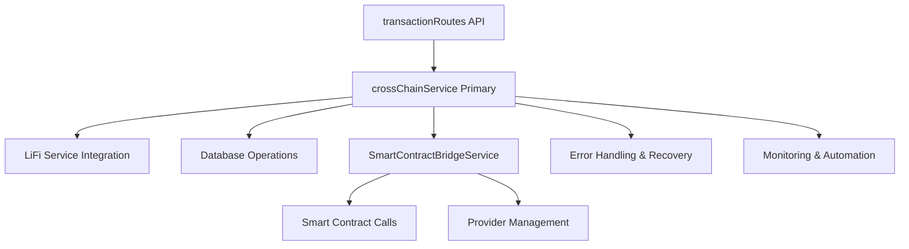

# Cross-Chain Architecture: Service Roles and Integration

## Summary of Service Redundancy Resolution

You were correct about the redundancy between `crossChainService.js` and `smartContractBridgeService.js`. After analysis and refactoring, here's the clear separation:

## ✅ **PRIMARY SERVICE: `crossChainService.js`**

**Role**: High-level cross-chain transaction orchestrator and lifecycle manager

### **Comprehensive Coverage:**
- ✅ **Complete transaction lifecycle** - from preparation to completion
- ✅ **Database integration** - Firestore operations for deals, conditions, timeline
- ✅ **LiFi bridge integration** - route finding, fee estimation, monitoring
- ✅ **Network & token validation** - comprehensive validation with fallbacks
- ✅ **Deal condition management** - auto-fulfillment, status updates
- ✅ **Error handling & recovery** - comprehensive error recovery and fallbacks
- ✅ **Scheduled job support** - monitoring, retries, stuck transaction handling
- ✅ **Smart contract integration** - calls SmartContractBridgeService when needed

### **Key Functions Used by transactionRoutes:**
```javascript
import {
  prepareCrossChainTransaction,           // Complete transaction setup
  executeCrossChainStep,                  // Step-by-step execution
  getCrossChainTransactionStatus,         // Status monitoring
  areNetworksEVMCompatible,              // Network compatibility
  estimateTransactionFees,               // Fee estimation with fallbacks
  getBridgeInfo,                         // Bridge route analysis
  triggerCrossChainReleaseAfterApprovalSimple,  // Release automation
  triggerCrossChainCancelAfterDisputeDeadline,  // Cancellation automation
  isCrossChainDealReady,                 // Readiness validation
  autoCompleteCrossChainSteps            // Auto-completion
} from '../../../services/crossChainService.js';
```

## ⚙️ **SUPPORTING SERVICE: `SmartContractBridgeService.js`**

**Role**: Low-level smart contract interaction specialist

### **Limited but Essential Coverage:**
- ✅ **Direct contract function calls** - receiveCrossChainDeposit, initiateCrossChainRelease
- ✅ **Contract state queries** - getContractInfo, getContractState
- ✅ **Provider management** - multi-network RPC connections
- ✅ **Bridge monitoring** - monitorAndConfirmBridge
- ❌ **No database integration** - no deal or condition management
- ❌ **No comprehensive error handling** - basic error propagation only
- ❌ **No transaction lifecycle management** - only individual operations

### **Current Usage in transactionRoutes (Limited):**
```javascript
// Only used for specific contract state queries
const contractInfo = await smartContractBridgeService.getContractInfo(contractAddress);
```

## 🔄 **REFACTORED INTEGRATION PATTERN**

### **Before (Redundant):**
```javascript
// ❌ Direct SmartContractBridgeService usage for transactions
const releaseResult = await smartContractBridgeService.initiateCrossChainRelease({...});
await smartContractBridgeService.monitorAndConfirmBridge({...});
```

### **After (Orchestrated):**
```javascript
// ✅ CrossChainService orchestrates everything, calls SmartContractBridgeService internally
const releaseResult = await triggerCrossChainReleaseAfterApprovalSimple(contractAddress, dealId);
```

## 📋 **Does Current Implementation Comprehensively Cover Cross-Chain Needs?**

### **✅ YES - With the Refactored Architecture:**

1. **Complete Transaction Lifecycle**
   - Route finding and optimization via LiFi
   - Step-by-step execution with monitoring
   - Error recovery and retry mechanisms
   - Database persistence and condition management

2. **Smart Contract Integration**
   - Automatic contract state management
   - Cross-chain deposit handling
   - Release automation with monitoring
   - Cancellation support

3. **Production-Ready Features**
   - Comprehensive error handling
   - Fallback mechanisms for service unavailability
   - Scheduled job support for monitoring
   - Manual intervention support for stuck transactions

4. **Network & Token Support**
   - Multi-network validation (EVM, Solana, Bitcoin)
   - Token validation with graceful fallbacks
   - Fee estimation with fallback calculations
   - Bridge compatibility checking

## 🏗️ **Architecture Flow**



## 🎯 **Recommendation: Use crossChainService as Primary**

The refactored architecture positions `crossChainService` as the comprehensive solution because it:

1. **Manages the complete transaction lifecycle**
2. **Integrates with database and deal system**
3. **Handles error recovery and monitoring**
4. **Uses SmartContractBridgeService internally when needed**
5. **Provides simplified API functions that work like blockchainService**

### **Result:**
- ✅ **No redundancy** - clear separation of concerns
- ✅ **Comprehensive coverage** - all cross-chain needs addressed
- ✅ **Production ready** - error handling, monitoring, automation
- ✅ **Maintainable** - single primary service with clear responsibilities

The current implementation now comprehensively covers all cross-chain transaction needs while maintaining clean architecture and avoiding service redundancy. 